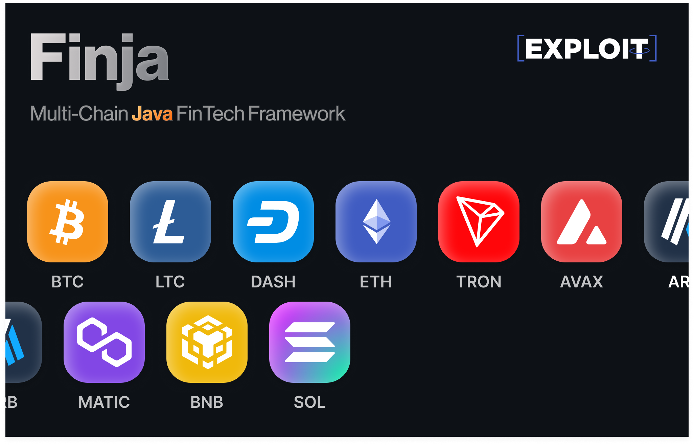

# Finja
> To start using Finja please see wiki in one of the languages: [Russian]() or [English]()

Finja is a multi-chain Java FinTech framework, intended to allow developers simply and securely implement cryptocurrencies in Finance applications.

Supported blockchains:
- **Bitcoin** (`Legacy/SegWit/Taproot`)
- **Litecoin** (`Legacy/SegWit/Taproot`)
- **Dash** (`Legacy`)
- **Bitcoin Cash** (`Legacy/CashAddr`)
- Any **EVM** based (**Ethereum**, **Optimism**, **Arbitrum**, **Binance**...)
- **Tron**
- **Solana**

Coming soon chains:
- **The Open Network (TON)**
- **Ripple (XRP)**
- **Cardano (ADA)**

## License
Finja is licensed under the [Apache License, Version 2.0](LICENSE.md)

